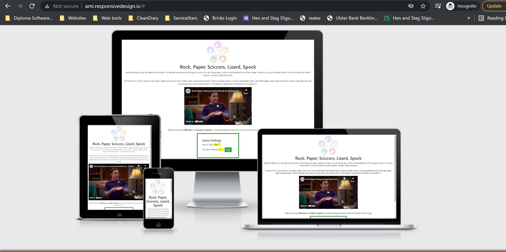

# Rock, Paper, Scissors

This website is deisgned to allow users play the traditional Rock, Paper, Scissors game against a computer. Users will have the option to play the traditional game with 3 choices or extend the game to the more difficult 5 choice game which has two further options of Lizard and Spock.

## Features

- Game settings
    - On the homepage, there is a [game settings section](assets/images/game-settings.jpg) which allows use to choose Easy or Hard and the number of games they wish to play. 
- Playing the game
    - When the user is playing the standard game, the user is given 3 options to play each move - namely, [Rock, Paper or Scissors](assets/images/game-play.jpg). If they choose the difficult version, they are given two further options - namely, [Lizard and Spock](assets/images/game-play-difficult.jpg).
    - When the user makes a move, the computer then makes a random move. Both moves are recorded in the [scoreboard section](assets/images/scoreboard.jpg).
- The scoreboard
    - There is a scoreboard that records the score of the game. The game finishes when the 
    The navigation is clear and simple. It displays the logo for Kennedys on the left and the 3 sections to the right (or under the logo in mobile view). 
    - [Click here for the wireframe](assets/images/wireframe.jpg)

- The Header

    - The header shows a photo of team at Kennedys with the slogan 'this is Rugby Country'. The pub has strong Rugby roots and is named after TJ Kennedy who played for Ireland in the 1970's.
    - The section provides a clear picture that this is a rugby pub.

- The Bookings Section

    - The booking section embed's the Resdiary booking portal. This gives the user instant access to reserving a table at Kennedys
    - Some of the features of the bar are highlighted on either side of the booking interface in desktop view. This is not displayed in mobile view.

- The Contact-Us Section

    - The contact section allows users to send a message to the bar and captures the necessary information like name, email and message.
    - It provides a quick and easy way of the user making contact

    

   - The Gallery Page

        - This provides the user with a selection of photos from Kennedys Bar. The images display a strong Rugby and live music theme.

      

## Technologies Used

Languages used:

- HTML
- CSS

## Planned Further Development

- I would like to use Javascript to make the navigation menu more responsive, particularily for mobile devices.

## Testing

- I tested that the page works in the different browsers: [Chrome](assets/images/chrome-testing.jpg), Safari (via [BrowserStack](http://www.browserstack.com)), [Firefox](assets/images/firefox-testing.jpg).
- I confirmed that this project is [responsive](assets/images/responsive-home.jpg), looks good and functions on all standard screen sizes using devtools device toolbar.
- I confirmed that the navigation, header, & contact-us text are all readable and easy to understand.
- I have confirmed that the form works. It requires entries at every field and it will only accept an email in the email field. The submit button works.

## Validator Testing

- HTML
    - No errors were found when passing through the official [W3C validator](https://validator.w3.org/#validate_by_input). Here are the results of each page - [Homepage](assets/images/index-html-check.jpg), [Contact-Us](assets/images/contact-us-html-check.jpg), [Gallery](assets/images/gallery-html-check.jpg). There is a warning relating to Javasc
- CSS
    - No errors were found when passing through the offical [Jigsaw validator](https://jigsaw.w3.org/css-validator/validator). [Click here](assets/images/css-check.jpg) for results.
- Accessibility
    - Confirmed that font choice was easy to read and accessible by running it through lighthouse in devtools. Note the best practices performance was effected by the inclusion of Javascript (for booking portal), which is outside of my control.

    

 ## Deployment

 ### Forking Instructions

 To fork this repo - go to the [Github page](https://github.com/fergalquinn77/project1) and click the fork button on the top right.

 ### Local deployment (Gitpod)

 The project was edited on [Gitpod](https://crimson-gibbon-dduyw9gq.ws-eu25.gitpod.io/). Edits were then regularily pushed to Github.
   
 ### GitHub Pages

 The project was deployed on GitHub Pages using the following steps:

1. Log in to GitHub and locate the [GitHub Repository](https://github.com/fergalquinn77/project1.git)
2. At the top of the Repository - click  "Settings" Button on the menu.
3. Under "Source", click the dropdown called "None" and select "Main Branch".
The page will automatically refresh.
Scroll back down through the page to locate the now [published site link](https://fergalquinn77.github.io/project1/) in the "GitHub Pages" section.

## Credits

### Content & Media

- All content was written by the developer. 
- Images for the Gallery section were taken by James Connelly Photography, Sligo

### Acknowledgements

- My mentor Chris Quinn was a great help throughout the project!. 