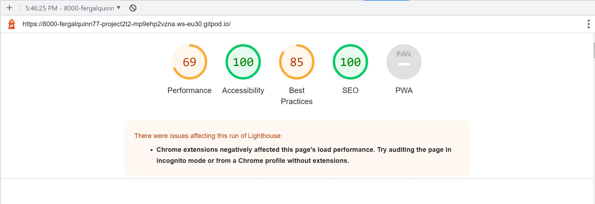

# Rock, Paper, Scissors - Project 2 - JavaScript

This website is deisgned to allow users play the traditional Rock, Paper, Scissors game against a computer. Users will have the option to play the traditional game with 3 choices or extend the game to the more difficult 5 choice game which has two further options of Lizard and Spock.

# Contents

## Objective

For my second project, I intend to create a the traditional, well-known, Rock-Scissors-Paper game. There will also be an option to play a more challenging version of the game which includes the Lizard & Spock moves. The main objective is to demonstrate competency in HTML, CSS and JavaScript. Additionally, the project will demonstrate thorough testing as detailed in the Testing Section.

## User Experience

### Design

- Colour Scheme/Background

    - There is a light gray used for the game area with a very slight opacity. The text color is black which provides good contrast to the light gray background. 

- Typograpghy

    - The Montserrat font is the main font used for the website with Sans Serif as the fallback font in case for any reason the font isn't being imported into the site correctly. Montserrat is a clean font used frequently in programming, so it is both attractive and appropriate.

- Imagery

    - In keeping with game name, a photo of Rock, Paper, Scissors sets the background for the game area.

### Wireframes

- [Homepage Wireframe](assets/images/desktop-wireframe.png)

- [Mobile Wireframe](assets/images/mobile-wireframe.png)

[Back to top](<#contents>)

## Features

- Game settings
    - On the homepage, there is a [game settings section](assets/images/game-settings.jpg) which allows use to choose Easy or Hard and the number of games they wish to play. 
- Playing the game
    - When the user is playing the standard game, the user is given 3 options to play each move - namely, [Rock, Paper or Scissors](assets/images/game-play.jpg). If they choose the difficult version, they are given two further options - namely, [Lizard and Spock](assets/images/game-play-difficult.jpg).
    - When the user makes a move, the computer then makes a random move. Both moves are recorded in the [scoreboard section](assets/images/scoreboard.jpg).
- The Scoreboard
    - There is a scoreboard that records the score of the game. The game finishes when the 
    The navigation is clear and simple. It displays the logo for Kennedys on the left and the 3 sections to the right (or under the logo in mobile view). 
- [Click here for the wireframe](assets/images/wireframe-game.jpg)

[Back to top](<#contents>)

## Future Features

[Back to top](<#contents>)

## Technologies Used

Languages used:

- HTML
- CSS
- Javascript

## Testing

- I tested that the page works in the different browsers: [Chrome](assets/images/chrome-testing-game.jpg), [Safari](assets/images/safari-testing-game.jpg), [Firefox](assets/images/firefox-testing-game.jpg).
- I confirmed that this project is [responsive](assets/images/game-responsive-design.jpg), looks good and functions on all standard screen sizes using devtools device toolbar.
- I confirmed all buttons are working right, executing the correct functions and displaying results correctly on the screen.

[Back to top](<#contents>)

## Validator Testing

- HTML
    - No errors were found when passing through the official [W3C validator](https://validator.w3.org/#validate_by_input). Here is the result - [Homepage](assets/images/game-html-check.jpg). 

- CSS
    - No errors were found when passing through the offical [Jigsaw validator](https://jigsaw.w3.org/css-validator/validator). [Click here](assets/images/game-css-check.jpg) for results.

- JavaScript
    - No errors were found when passing through the [JSHint Validator](https://jshint.com/). [Click here](assets/images/game-java-check.jpg) 

- Accessibility
    - Confirmed that font choice was easy to read and accessible by running it through lighthouse in devtools. 

    

[Back to top](<#contents>)

## Deployment

### Forking Instructions

 To fork this repo - go to the [Github page](https://github.com/fergalquinn77/project2_t2.git) and click the fork button on the top right.

 ### Local deployment (Gitpod)

 The project was edited on [Gitpod](https://fergalquinn77.github.io/project2_t2/). Edits were then regularily pushed to Github.
   
 ### GitHub Pages

 The project was deployed on GitHub Pages using the following steps:

1. Log in to GitHub and locate the [GitHub Repository](https://github.com/fergalquinn77/project2_t2.git)
2. At the top of the Repository - click  "Settings" Button on the menu.
3. Under "Source", click the dropdown called "None" and select "Main Branch".
The page will automatically refresh.
Scroll back down through the page to locate the now [published site link](https://fergalquinn77.github.io/project2_t2/) in the "GitHub Pages" section.

[Back to top](<#contents>)

## Credits

### Content & Media

- All content was written by the developer.
- [Fandom.com](https://bigbangtheory.fandom.com/wiki/Rock,_Paper,_Scissors,_Lizard,_Spock) for logo 
- [Big Bang Theory](https://www.youtube.com/watch?v=x5Q6-wMx-K8) for YouTube Video
- [Facts.net](https://facts.net/rock-paper-scissors-facts/) for the background image
- [Wikopedia](https://en.wikipedia.org/wiki/Rock_paper_scissors) for the game description

### Acknowledgements

- My mentor Chris Quinn was a great help throughout the project!. I would also like to thank Ger, Jo, Sean and John who are part of the Code Institute tutoring team.

### Personal Development

[Back to top](<#contents>)