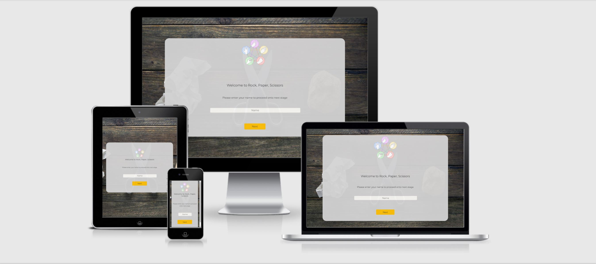

# Rock, Paper, Scissors - Project 2 - JavaScript

This website is designed to allow users play the traditional Rock, Paper, Scissors game against a computer. Users will have the option to play the traditional game with 3 choices or extend the game to the more difficult 5 choice game which has two further options of Lizard and Spock.



# Contents

* [**Objective**](<#objective>)
* [**User Experience UX**](<#user-experience>)
    * [Design](<#design>)
    * [Wireframes](<#wireframes>)
* [**Features**](<#features>)
* [**Future Features**](<#future-features>)
* [**Technologies Used**](<#technologies-used>)
    * [Languages Used](<#languages-used>)
    * [Frameworks, Libraries & Programs Used](<#frameworks,-libraries-&-programs-used>)
* [**Tesing**](<#testing>)
    * [Validator Testing](<#validator-testing>)
    * [Other Testing](<#further-testing>)
* [**Deployment**](<#deployment>)
    * [Github Pages](<#github-pages>)
    * [Forking the GitHub Repository](<#forking-the-github-repository>)
    * [Making a Local Clone](<#making-a-local-clone>)
* [**Credits**](<#credits>)
    * [Content & Media](<#content-&-media>)
    * [Acknowledgements](<#acknowledgements>)
    * [Personal Development](<personal-development>)


## Objective

For my second project, I intend to create the traditional, well-known, Rock-Scissors-Paper game. There will also be an option to play a more challenging version of the game which includes the Lizard & Spock moves. The main objective is to demonstrate competency in HTML, CSS and JavaScript. Additionally, the project will demonstrate thorough testing as detailed in the Testing Section.

## User Experience

### Design

- Colour Scheme/Background

    - There is a light grey used for the game area with a very slight opacity. The text color is black which provides good contrast to the light gray background. 

- Typography

    - The Montserrat font is the main font used for the website with Sans Serif as the fall-back font in case for any reason the font isn't being imported into the site correctly. Montserrat is a clean font used frequently in programming, so it is both attractive and appropriate.

- Imagery

    - In keeping with game name, a photo of Rock, Paper, Scissors sets the background for the game area.

### Wireframes

- [Homepage Wireframe](assets/images/desktop-wireframe.png)

- [Mobile Wireframe](assets/images/mobile-wireframe.png)

[Back to top](<#contents>)

## Features

- Homepage
    - In order to start the game, the user is asked for their name on the [homepage](assets/images/game-homepage.jpg). 
- Instructions on how to play
    - After inputting their name, the user is asked whether they would like to [learn about the game or play now](assets/images/step2.jpg). If they would like instructions, they are firstly presented with those relating to the [standard game](assets/images/learn-more.jpg) and then those relating to the [difficult version](assets/images/learn-difficult.JPG).
    
- Playing the game
    - When the user selects 'Play Now', they are brought to a [game settings page](assets/images/game-settings-page.jpg), where they can choose the number of moves and then the level of difficulty.
    - Once the users [chooses a move](assets/images/game-playing-area.jpg), the computer randomly chooses a move and both moves are recorded on the scoreboard.

- The Scoreboard
    - There is a scoreboard that records the score of the game. When the game finishes, the user is displayed with a [message](assets/images/game-over.jpg) indicating who won the game. 

[Back to top](<#contents>)

## Future Features

- Sound

    - I would like to add sound to the game to improve the user experience.

- Delay

    - I would like to incorporate a delay in the computers move, to make it more realistic. For instance, the user selects his move, then the computer moves about a second later. I feel this would improve the user experience.


[Back to top](<#contents>)

## Technologies Used

### Languages Used

- HTML
- CSS
- JavaScript

### Frameworks, Libraries & Programs Used

1. Bootstrap
    - Bootstrap was used to assist the styling of buttons on the website.
2. Google Fonts
    - Google fonts were used to import the 'Montserrat font' font into the style.css file which is used on all pages throughout the project.
3. Font Awesome
    - Font Awesome was used on all pages throughout the website to add icons for aesthetic and UX purposes.
4. Git
    - Git was used for version control by utilizing the Gitpod terminal to commit to Git and Push to GitHub.
5. Github
    - GitHub is used to store the projects code after being pushed from Git.
6. Balsamiq
    - Balsamiq was used to create the [wireframes](<#wireframes>) during the design process.


## Testing

### Validator Testing

- HTML
    - No errors were found when passing through the official [W3C validator](https://validator.w3.org/#validate_by_input). Here is the result - [Homepage](assets/images/game-html-check.jpg). 

- CSS
    - No errors were found when passing through the official [Jigsaw validator](https://jigsaw.w3.org/css-validator/validator). [Click here](assets/images/game-css-check.jpg) for results.

- JavaScript
    - No errors were found when passing through the [JSHint Validator](https://jshint.com/). [Click here](assets/images/game-java-check.jpg) 

- Accessibility
    - Confirmed that font choice was easy to read and accessible by running it through lighthouse in devTools. 

    

### Further Testing

- I tested that the page works in the different browsers: [Chrome](assets/images/game-chrome-display.jpg), [Safari](assets/images/game-safari-display.jpg), [Firefox](assets/images/firefox-testing-game.jpg).
- I confirmed that this project is [responsive](assets/images/game-responsive-design.jpg), looks good and functions on all standard screen sizes using devtools device toolbar.
- I confirmed all buttons are working right, executing the correct functions and displaying results correctly on the screen.

[Back to top](<#contents>)


## Deployment

### Github Pages

The project was deployed to GitHub Pages using the following steps...

1. Log in to GitHub and locate the GitHub Repository
2. At the top of the Repository (not top of page), locate the "Settings" Button on the menu.
3. Scroll down the Settings page until you locate the "GitHub Pages" Section.
4. Under "Source", click the dropdown called "None" and select "Master Branch".
5. The page will automatically refresh.
6. Scroll back down through the page to locate the now published site link in the "GitHub Pages" section.

 ### Forking the GitHub Repository

By forking the GitHub Repository we make a copy of the original repository on our GitHub account to view and/or make changes without affecting the original repository by using the following steps...

1. Log in to GitHub and locate the [GitHub Repository](https://github.com/fergalquinn77/project2_t2.git)
2. At the top of the Repository (not top of page) just above the "Settings" Button on the menu, locate the "Fork" Button.
3. You should now have a copy of the original repository in your GitHub account.

### Making a Local Clone

1. Log in to GitHub and locate the [GitHub Repository](https://github.com/fergalquinn77/project2_t2.git)
2. Under the repository name, click "Clone or download".
3. To clone the repository using HTTPS, under "Clone with HTTPS", copy the link.
4. Open Git Bash
5. Change the current working directory to the location where you want the cloned directory to be made.
6. Type `git clone`, and then paste the URL you copied in Step 3.

```
$ git clone https://github.com/YOUR-USERNAME/YOUR-REPOSITORY
```

7. Press Enter. Your local clone will be created.

```
$ git clone https://github.com/YOUR-USERNAME/YOUR-REPOSITORY
> Cloning into `CI-Clone`...
> remote: Counting objects: 10, done.
> remote: Compressing objects: 100% (8/8), done.
> remove: Total 10 (delta 1), reused 10 (delta 1)
> Unpacking objects: 100% (10/10), done.
```

Click [Here](https://help.github.com/en/github/creating-cloning-and-archiving-repositories/cloning-a-repository#cloning-a-repository-to-github-desktop) to retrieve pictures for some of the buttons and more detailed explanations of the above process.

[Back to top](<#contents>)

## Credits

### Content & Media

- All content was written by the developer.
- [Fandom.com](https://bigbangtheory.fandom.com/wiki/Rock,_Paper,_Scissors,_Lizard,_Spock) for logo 
- [Big Bang Theory](https://www.youtube.com/watch?v=x5Q6-wMx-K8) for YouTube Video
- [Facts.net](https://facts.net/rock-paper-scissors-facts/) for the background image
- [Wikopedia](https://en.wikipedia.org/wiki/Rock_paper_scissors) for the game description

### Acknowledgements

- My mentor Chris Quinn was a great help throughout the project!. I would also like to thank Ger, Jo, Sean and John who are part of the Code Institute tutoring team.

### Personal Development

- This project took three attempts. My first attempt (on a [separate repo](https://github.com/fergalquinn77/project2.git)) was my first JavaScript project. It turned out to be learning experience with JavaScript and figuring out how it fits in with the DOM. It had a lot of changes and commit's so I felt it was best to start the project again with a [new repo](https://github.com/fergalquinn77/project2_t2.git). The new repo project/website functionally worked fine but I felt it had a poor user experience - especially in [desktop view](assets/images/homepage-game.jpg). I should have given more thought to the layout and game-flow. The [previous wireframe](assets/images/wireframe-game.jpg) didn't give enough thought to UX.

- I felt it was best to relook at the website design. I redesigned the website using a more thought out [wireframe](<#wireframes>). The new design required much more work on Html/CSS which I feel paid off in many ways in the end. The website delivers a better UX and I learnt a huge amount about HTML/CSS areas I needed to improve my knowledge on, like positioning and display of elements. The tutors were a great help here.

- While the final project still requires work (as covered in the [Future Features](<#future-features>)) section, I feel the project was a great learning experience!  

[Back to top](<#contents>)